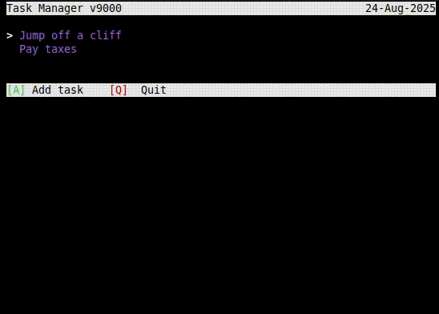

### Task Manager v9000
#### 

Yet another task manager, this time built with a Terminal User Interface. Uses xterm and VT100 escape codes to manually handle flow in the terminal. Creates a sqlite db in your home directory ($HOME/.db/tasks) to store data. Tested on Linux only (no actual tests).

**Installation**:

```
go install github.com/nn-advith/tui-taskmanager@latest
```

**Execution**:

```
tui-taskmanager
```

> Note: If the above command doesnt work, ensure that $HOME/go/bin has been added to the environment.

**Shortcut script**:

You can add a custom shortcut to open the task manager with the help of ```add_ubuntu_shortcut.sh``` (Tested only on Ubuntu. Should work on other debian distros. Probably.)

```
bash <(curl -fsSL https://raw.githubusercontent.com/nn-advith/tui-taskmanager/master/add_ubuntu_shortcut.sh) ["<CUSTOM BINDING LETTER>" | default "N"]
```

Demo:



<span style="font-size:10px">ps: abysmmal code design.</span>
